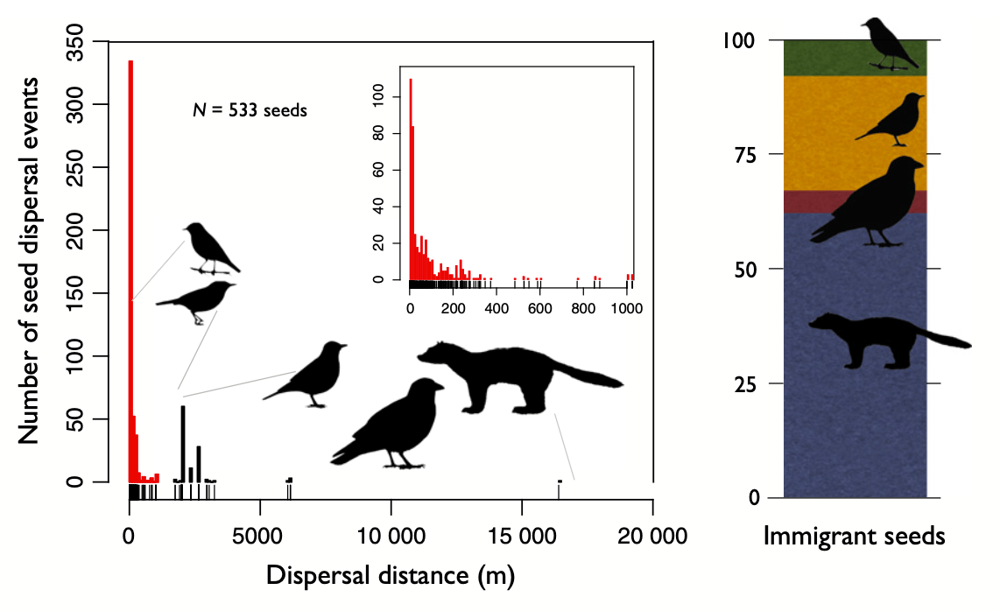

<!-- Generated by fetch-wordpress.py from https://pedrojordano.wordpress.com/2026/09/22/__trashed-3/ — do not edit by hand. -->

```{=html}

<h1 class="wp-block-heading"></h1>
<p class="has-text-align-center wp-block-paragraph"></p>
<p class="wp-block-paragraph">Long-distance dispersal (LDD), especially for plants, poses tremendous challenges for study, sampling and analysis (Jordano 2017).</p>
<p class="wp-block-paragraph">Though infrequent, LDD events drive colonization, genetic diversity, and responses to environmental change. Their proper characterization is complicated because they occur over vast spatial extensions and they happen very rarely. They are extremely rare events whose documentation requires sampling far away from the seed sources, with extensive designs that allow a minimal chance of getting one of those events.</p>
<p class="wp-block-paragraph">LDD events in plants share three main characteristics:</p>
<ol class="wp-block-list">
<li>They’re extremely infrequent.</li>
<li>They involve very, very long dispersal distances away from the seed source (maternal) plant.</li>
<li>That may have disproportionately important consequences in comparison to their rare occurrence.</li>
</ol>
<p class="wp-block-paragraph">A persistent challenge in dispersal ecology has been the robust characterization of dispersal functions (kernels), a fundamental tool to predict how dispersal processes respond under global change scenarios. Particularly, the rightmost tail of these functions, that is the long-distance dispersal (LDD) events, are difficult to characterize empirically and to model in realistic ways.</p>
<p class="wp-block-paragraph">During the past 40 years we have studying animal-mediated seed dispersal by using new techniques that allow a robust analysis of two specific questions in dispersal studies: 1) for any dispersed seed that we can sample on the forest ground, which is the source tree where the frugivore picked the fruit?, and 2) for that sampled seed, which species is the frugivore that disseminated the seed to that specific microsite?</p>
<p class="wp-block-paragraph">The first question has a lot of power for seed dispersal studies: how far from the maternal tree source did animal frugivores (or wind) transport the seeds? Imagine you find a dispersed seed of <em>Prunus mahaleb</em> within a scat of badger in a specific point of the forest; which the distance between that point and the tree where this badger removed the fruit? You automatically get a vector connecting the source tree and the specific locations where one of its propagules was disseminated.</p>
<p class="wp-block-paragraph">But when is it a LDD event? In the special case of plants, dispersal has three basic components: (i) a distinct (sessile) source, the maternal plant producing the fruits or the paternal tree acting as a source of pollen; (ii) a distance component between source and target locations; and (iii) a vector<br/>actually performing the movement entailing the dispersal event. Thus dispersal events have two basic intrinsic properties: (i) events crossing geographic boundaries among stands; and (ii) events contributing to effective gene ow and propagule migration.</p>
<p class="wp-block-paragraph">Strict-sense long-distance dispersal involves movement both outside the stand geographic limits and outside the genetic neighbourhood area of individuals. Combinations of propagule movements within/outside these two spatial reference frames result in four distinct modes of LDD.</p>
<figure class="wp-block-table is-style-stripes"><table class="has-fixed-layout"><thead><tr><th>Genetic neighbourhood limit</th><th>Population neighbourhood limit</th><th> </th></tr></thead><tbody><tr><td> </td><td>Within</td><td>Outside</td></tr><tr><td>Within</td><td>Within-neighbourhood, long-distance dispersal, <math data-latex="LDD_{neigh}"><semantics><mrow><mi>L</mi><mi>D</mi><msub><mi>D</mi><mrow><mi>n</mi><mi>e</mi><mi>i</mi><mi>g</mi><mi>h</mi></mrow></msub></mrow><annotation encoding="application/x-tex">LDD_{neigh}</annotation></semantics></math></td><td>Local, short distance events, <math data-latex="SDD_{loc}"><semantics><mrow><mi>S</mi><mi>D</mi><msub><mi>D</mi><mrow><mi>l</mi><mi>o</mi><mi>c</mi></mrow></msub></mrow><annotation encoding="application/x-tex">SDD_{loc}</annotation></semantics></math></td></tr><tr><td>Outside</td><td>Local, long distance events, <math data-latex="LDD_{loc}"><semantics><mrow><mi>L</mi><mi>D</mi><msub><mi>D</mi><mrow><mi>l</mi><mi>o</mi><mi>c</mi></mrow></msub></mrow><annotation encoding="application/x-tex">LDD_{loc}</annotation></semantics></math></td><td>Strict-sense, long-distance dispersal, <math data-latex="LDD_{SS}"><semantics><mrow><mi>L</mi><mi>D</mi><msub><mi>D</mi><mrow><mi>S</mi><mi>S</mi></mrow></msub></mrow><annotation encoding="application/x-tex">LDD_{SS}</annotation></semantics></math></td></tr></tbody></table><figcaption class="wp-element-caption">A taxonomy of seed dispersal events mediated by animal frugivores. The outcome in terms of LDD event depends on whether the movement within- or outside- the plant population neighbrohood limits (both geographical and genetic).</figcaption></figure>
<p class="wp-block-paragraph">The result of that combination of dispersal events (e.g., at the end of the fruiting period of a plant population) is a seed shadow (Janzen 1978, Jordano &amp; Godoy 2002): a 2D distribution of seeds over the ground surface as a result of seed dissemination by animals. While a seed shadow is typically bidimensional (Janzen 1970), we can collapse to a seed dispersal kernel to illustrate the probability of seeds reaching any given distance away from the maternal plant (Jordano 2017).</p>
<figure class="wp-block-image size-full"><a href="images/kernel_pmah.png"></a></figure>
<p class="wp-block-paragraph">Thus the kernel is just an empirical frequency distribution of seed dispersal events as a function of dispersal distance by animal frugivores. The figure illustrates that for <em>Prunus mahaleb</em> frugivores in SE Spain. In red, left (inset), frequencies of within-population dispersal events inferred from direct assignment based on seed endocarp genotypes and maternal trees genotypes. Larger frame, left, contributions of four functional frugivore groups (small birds, medium- and large-sized birds, and mammals) to seed dissemination and proportional contributions (right bar) to dispersal of the inferred immigrant seeds (i.e. those not matching any maternal tree in the study population).</p>
<p class="wp-block-paragraph">These are typically extremely “fat-tailed” distributions of events, so that we can properly talk about extreme events to characterize those seed dispersal events that involve long-distance dispersal (García &amp; Borda-de-Água 2016).</p>
<p class="wp-block-paragraph">To sum up, we can expect truncation of seed dispersal kernels to have multiple consequences on demography and genetics, following to the loss of key dispersal services in natural populations. Irrespective of neighbourhood sizes, loss of LDD events may result in more structured and less cohesive genetic pools, with increased isolation by distance extending over broader areas. Proper characterization of the LDD events helps to assess, for example, how the ongoing defaunation of large-bodied frugivores pervasively entails the loss of crucial LDD functions.</p>
<h3 class="wp-block-heading">References</h3>
<p class="wp-block-paragraph">García, C., &amp; Borda-de-Água, L. (2016). Extended dispersal kernels in a changing world: Insights from statistics of extremes [Journal Article]. <em>Journal of Ecology</em>, <em>105</em>, 63–74. <a href="https://doi.org/10.1111/1365-2745.12685">https://doi.org/10.1111/1365-2745.12685</a></p>
<p class="wp-block-paragraph"><br/>Janzen, D. H. (1970). Herbivores and the number of tree species in tropical forests [Journal Article]. <em>American Naturalist</em>, <em>104</em>(940), 501-+. <a href="https://doi.org/Doi%2010.1086/282687">https://doi.org/Doi 10.1086/282687</a></p>
<p class="wp-block-paragraph">Janzen, D. H. (1978). Size of a local peak in a seed shadow [Journal Article]. <em>Biotropica</em>, <em>10</em>(1), 78–78. <a href="https://doi.org/Doi%2010.2307/2388115">https://doi.org/Doi 10.2307/2388115</a></p>
<p class="wp-block-paragraph">Jordano, P. (2017). What is long-distance dispersal? And a taxonomy of dispersal events [Journal Article]. <em>Journal of Ecology</em>, <em>105</em>(1), 75–84. <a href="https://doi.org/10.1111/1365-2745.12690">https://doi.org/10.1111/1365-2745.12690</a></p>
<p class="wp-block-paragraph">Jordano, P., &amp; Godoy, J. A. (2002). Frugivore-generated seed shadows: A landscape view of demographic and genetic effects. In D. Levey, W. Silva, &amp; M. Galetti (Eds.), <em>Seed dispersal and frugivory: Ecology, evolution, and conservation</em> (pp. 305–321). <a href="https://doi.org/papers2://publication/uuid/7BFA8326-5797-4C1B-B55F-6DBC347DB418">https://doi.org/papers2://publication/uuid/7BFA8326-5797-4C1B-B55F-6DBC347DB418</a></p>

```

::: {.wp-original}
Originally published on [my WordPress blog](https://pedrojordano.wordpress.com/2026/09/22/__trashed-3/).
:::
