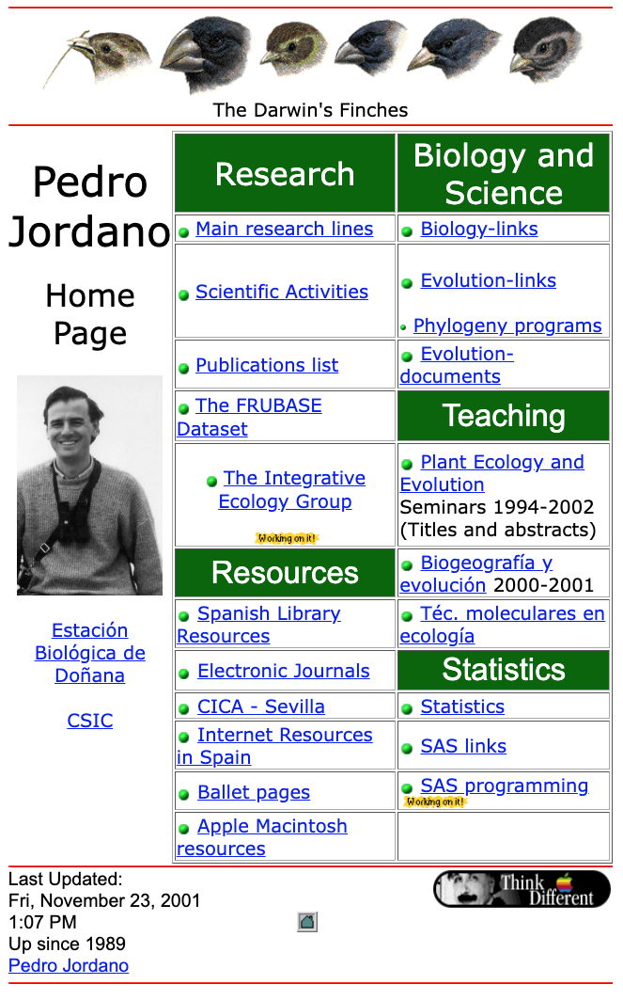

+---------------------------------------------------+--------------------------+
|             | These are some available |
|                                                   | resources derived from   |
|                                                   | our research activities. |
|                                                   | Please contact us if you |
|                                                   | need further             |
|                                                   | information.             |
|                                                   |                          |
|                                                   | **Contact                |
|                                                   | Information:**\          |
|                                                   | Estación Biológica de    |
|                                                   | Doñana, CSIC\            |
|                                                   | Isla de La Cartuja\      |
|                                                   | Avda. Americo Vespucio   |
|                                                   | 26\                      |
|                                                   | E-41092 Sevilla, Spain\  |
|                                                   | \                        |
|                                                   | \< h                     |
|                                                   | ttps://www.ebd.csic.es\> |
+---------------------------------------------------+--------------------------+

--------------------------------------------------------------------------------

:::: resource-row
[{fig-alt="Projects"}](projects.html)

::: resource-text
[Projects](projects.html "Projects")
:::
::::

:::: resource-row
[{fig-alt="Repository web pages @GitHub Datasets Lab repository @GitHub Pedro's r"}](http://pedroj.github.io/)

::: resource-text
[Repository web pages \@GitHub](http://pedroj.github.io/)\
[Datasets](datasets.html "Datasets")\
[Lab repository \@GitHub](https://github.com/PJordano-Lab)\
[Pedro's repository \@GitHub](https://github.com/pedroj)
:::
::::

:::: resource-row
[{fig-alt="Study sites"}](gallery.html)

::: resource-text
[Study sites](gallery.html "Study sites")
:::
::::

:::: resource-row
{fig-alt="Lab Protocols The Lab R Code repository @GitHub R R Documentation R Pa"}

::: resource-text
Lab Protocols\
[{.inline-icon}{.inline-icon}The
Lab R Code repository \@GitHub](https://github.com/PJordano-Lab/R-figures)

[R](http://www.r-project.org/)\
[R Documentation](https://www.rdocumentation.org)\
[R Packages](http://finzi.psych.upenn.edu/R/doc/html/packages.html)\
[RStudio](https://www.rstudio.com)\
[R Markdown](http://rmarkdown.rstudio.com/index.html)\
[Simple R](http://www.math.csi.cuny.edu/Statistics/R/simpleR/index.html)

Statistics & R tutorials by [Francisco
Rodrígue-Sánchez](https://frodriguezsanchez.net/)

-   [Spatial data in R: using R as a GIS (new
    version).](http://pakillo.github.io/R-GIS-tutorial/)

-   [Reproducible Research with Rmarkdown: data management, analysis and
    reporting
    all-in-one.](http://figshare.com/articles/Reproducible_Research_with_Rmarkdown_data_management_analysis_and_reporting_all_in_one/913593)

-   [Model selection and balanced complexity: AIC, BIC, DIC and
    beyond.](http://figshare.com/articles/Model_selection_and_balanced_complexity_AIC_BIC_DIC_and_beyond/789056)

-   [Model selection in practice (or 'Which variables should I keep in my
    model?').](http://figshare.com/articles/Model_selection_in_practice_or_Which_variables_should_I_keep_in_my_model_/972886)
:::
::::

:::: resource-row
[{fig-alt="Galleries"}](gallery.html)

::: resource-text
[Galleries](gallery.html "Gallery")
:::
::::

:::: resource-row
[{fig-alt="Media"}](http://PJordano-Lab.ebd.csic.es/outreach/)

::: resource-text
[Media](media.html "Media")
:::
::::

:::: resource-row
[{fig-alt="Talks"}](teaching.html)

::: resource-text
[Teaching](teaching.html "Teaching")
:::
::::

:::: resource-row
{fig-alt="PGP Pedro's public keys"
fig-align="left"}

::: resource-text
[Website history](website_hist.qmd)
:::
::::

--------------------------------------------------------------------------------